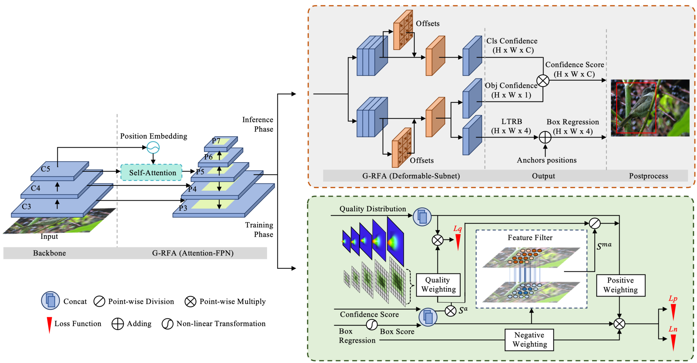

# Features Alignment In Anchor-Free Object Detection

## Motivation
# 
Compared with our method, the spatial distributions of the classification heatmap and the regression heatmap in other methods are not consistent. Although there exists a tendency of gradual contraction and convergence, the two distributions are still not effectively aligned. In addition, other methods have inevitably recognized some noisy points with inconsistent performances in classification and regression as the foreground, which confuse the network in the training phase. In contrast, our method produces a foreground map that is more focused on good sampling points with high regression and classification scores simultaneously.

## Pipeline
# 

This is a PyTorch implementation version of the paper Features Alignment In Anchor-Free Object Detection. In this paper, we focus on solving the feature misalignment problem for anchor-free object detection methods, and the main contributions include
- G-RFA
- feature filter (FF)
- multi-layer quality distributions (MDQ) and corresponding quality weighting mechanism

More details can be found in the paper.
## Get Started

1. install [cvpods](https://github.com/Megvii-BaseDetection/cvpods) following the instructions

```shell
# Install cvpods
git clone https://github.com/Megvii-BaseDetection/cvpods
cd cvpods 
## build cvpods (requires GPU)
pip install -r requirements.txt
python setup.py build develop
## preprare data path
mkdir datasets
ln -s /path/to/your/coco/dataset datasets/coco
```

2. run the project

```shell
cd feature_align.coco

# train
pods_train --num-gpus 4

#train from exist weight, then the code will retrained from the 'last_checkpoint'
pods_train --num-gpus 4 --resume

# test
pods_test --num-gpus 4
# test with provided weights
pods_test --num-gpus 4 MODEL.WEIGHTS /path/to/your/model.pth
```


## Results
Our method consistently surpasses the other methods by changing the backbone and the multi-scale training interval. Only with the improvements on label assignment strategy (FF anf MDQ), our method can bring the detection performance from our baseline method (Autoassign) to a competitive level of 47.2\%AP on ResNeXt-101-64x4d. Combined with G-RFA, we achieve 49.3\% AP with the backbone of ResNeXt-10164x4d, surpassing other related methods.

| Model | Multi-scale training | Multi-scale testing | Backbone | AP |
|:--- |:--------------------:|:--------------------:|:-----------------:|:-------:|
| Autoassign (baseline) | No | No | Res50 | 40.4 |
| Ours | No | No | Res50 | 41.1 |
| Ours† | No | No | Res50 | 43.5 |
| Autoassign (baseline) | yes | No | Res101 | 44.5 |
| Ours | yes | No | Res101 | 45.3 |
| Ours† | yes | No | Res101 | 46.8 |
| Ours† w/ Wms1 | yes | No | Res101 | 46.9 |
| Ours† w/ Wms2 | yes | No | Res101 | 47.4 |
| Autoassign (baseline) | yes | No | ResXt101-64x4d| 46.5 |
| Ours | yes | No | ResXt101-64x4d | 47.2 |
| Ours† | yes | No | ResXt101-64x4d | 48.0 |
| Ours† w/ Wms1 | yes | No | ResXt101-64x4d | 48.5 |
| Ours† w/ Wms2 | yes | No | ResXt101-64x4d | 49.3 |

The results are evaluated on the COCO val split and COCO test-dev, and more results can be found in the paper.

## Acknowledgement

This repo is developed based on cvpods and AutoAssign. Please check [cvpods](https://github.com/Megvii-BaseDetection/cvpods) and [AutoAssign](https://github.com/Megvii-BaseDetection/AutoAssign) for more details and features.

