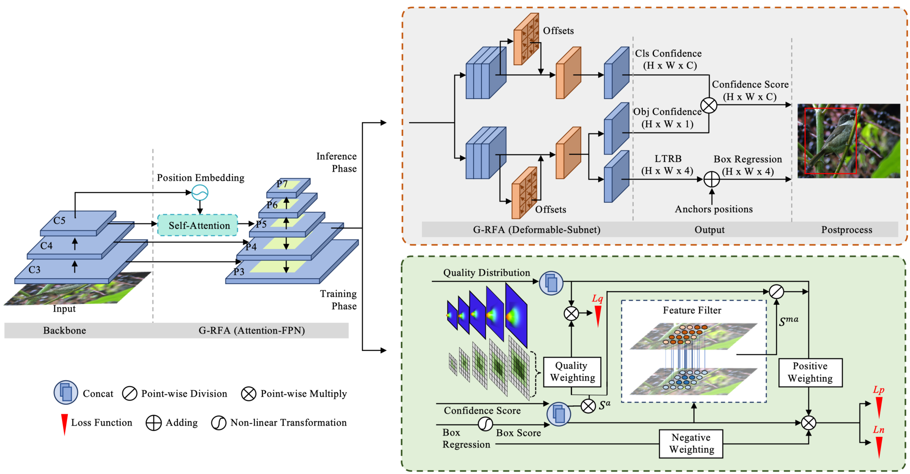

# Features Alignment In Anchor-Free Object Detection

# 

This is a PyTorch implementation version.

## Get Started

1. install [cvpods](https://github.com/Megvii-BaseDetection/cvpods) following the instructions

```shell
# Install cvpods
git clone https://github.com/Megvii-BaseDetection/cvpods
cd cvpods 
## build cvpods (requires GPU)
pip install -r requirements.txt
python setup.py build develop
## preprare data path
mkdir datasets
ln -s /path/to/your/coco/dataset datasets/coco
```

2. run the project

```shell
cd feature_align.coco

# train
pods_train --num-gpus 4

#train from exist weight, then the code will retrained from the 'last_checkpoint'
pods_train --num-gpus 4 --resume

# test
pods_test --num-gpus 4
# test with provided weights
pods_test --num-gpus 4 MODEL.WEIGHTS /path/to/your/model.pth
```


## Results

| Model | Multi-scale training | Multi-scale testing | Backbone | AP (minival) |
|:--- |:--------------------:|:--------------------:|:-----------------:|:-------:|
| Ours | No | No | Res50 | 41.1 |
|:--- |:--------------------:|:--------------------:|:-----------------:|:-------:|
| Ours† | No | No | Res50 | 43.5 |
|:--- |:--------------------:|:--------------------:|:-----------------:|:-------:|
| Ours | yes | No | Res101 | 45.3 |
|:--- |:--------------------:|:--------------------:|:-----------------:|:-------:|
| Ours† | yes | No | Res101 | 46.8 |
|:--- |:--------------------:|:--------------------:|:-----------------:|:-------:|
| Ours† w/ Wms1 | yes | No | Res101 | 46.9 |
|:--- |:--------------------:|:--------------------:|:-----------------:|:-------:|
| Ours† w/ Wms2 | yes | No | Res101 | 47.4 |
|:--- |:--------------------:|:--------------------:|:-----------------:|:-------:|
| Ours | yes | No | ResXt101-64x4d | 47.2 |
|:--- |:--------------------:|:--------------------:|:-----------------:|:-------:|
| Ours† | yes | No | ResXt101-64x4d | 48.0 |
|:--- |:--------------------:|:--------------------:|:-----------------:|:-------:|
| Ours† w/ Wms1 | yes | No | ResXt101-64x4d | 48.5 |
|:--- |:--------------------:|:--------------------:|:-----------------:|:-------:|
| Ours† w/ Wms2 | yes | No | ResXt101-64x4d | 49.3 |
|:--- |:--------------------:|:--------------------:|:-----------------:|:-------:|

##Acknowledgement
This repo is developed based on cvpods and AutoAssign. Please check [cvpods](https://github.com/Megvii-BaseDetection/cvpods) and [AutoAssign](https://github.com/Megvii-BaseDetection/AutoAssign) for more details and features.

## License
This repo is released under the Apache 2.0 license. Please see the LICENSE file for more information.

